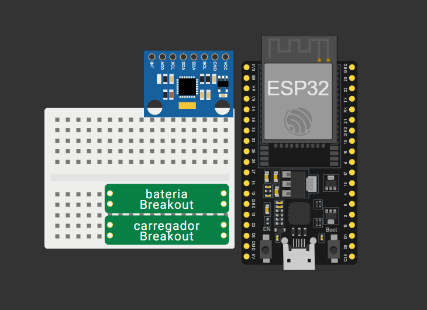

# GAEK Motion 

Este projeto consiste em um sistema de telemetria, onde captura dados de movimento e orientação através de uma ESP32 e processando-os em uma arquitetura moderna de backend para visualização em tempo real.

## Visão Geral

O projeto utiliza um **ESP32** para coletar dados de acelerômetro, giroscópio e magnetômetro. Esses dados são enviados para um sistema de filas através do RabbitMQ trafegando um JSON para uma API em Node.js, persistidos em um banco relacional PostgreSQL e visualizados em um dashboard interativo.

### Arquitetura e Circuito
* **Diagrama de Arquitetura (v1):** https://www.tldraw.com/f/dy98VYG4w8V-BFpn38e13?d=v-369.-391.1878.1008.page
* **Protótipo do Circuito:**



---

## Stack Utilizada

| Camada | Ferramentas |
| :--- | :--- |
| **Hardware** | ESP32, MPU-9250 (IMU), Breakout de Bateria/Carregador |
| **Firmware/IDE** | Arduino IDE, VS Code, Antigravity |
| **Prototipagem** | Wokwi |
| **Backend** | Node.js, Express, Prisma ORM, RabbitMQ |
| **Banco de Dados** | PostgreSQL |
| **Frontend** | React + Tailwind CSS, Lovable, Looker Studio |
| **Hospedagem** | Cloudflare, AWS ou Servidor UNIMAR |

---

## Formato de Dados (JSON)

Os dados são transmitidos e processados seguindo este formato para análise:

```json
{
  "dadosGraficos": {
    "acelerometro": {
      "x": [9.87, 9.84, 9.89, 10.05, 9.86],
      "y": [0.17, 0.21, 0.18, 0.25, 0.19],
      "z": [0.53, 0.57, 0.55, 0.60, 0.54]
    },
    "giroscopio": {
      "x": [1.3, 1.6, 1.4, 1.7, 1.5],
      "y": [21.1, -16.0, 23.0, -19.5, 22.3],
      "z": [0.9, 0.8, 1.0, 0.7, 0.9]
    },
    "magnetometro": {
      "x": [29.8, 30.0, 29.9, 29.7, 29.9],
      "y": [-15.7, -15.6, -15.8, -15.7, -15.6],
      "z": [-45.4, -45.5, -45.3, -45.4, -45.2]
    },
    "orientacao": {
      "roll": [1.3, 1.4, 1.3, 1.5, 1.4],
      "pitch": [-2.6, -2.7, -2.5, -2.8, -2.6],
      "yaw": [86.2, 86.3, 86.1, 86.4, 86.2]
    }
  }
}
